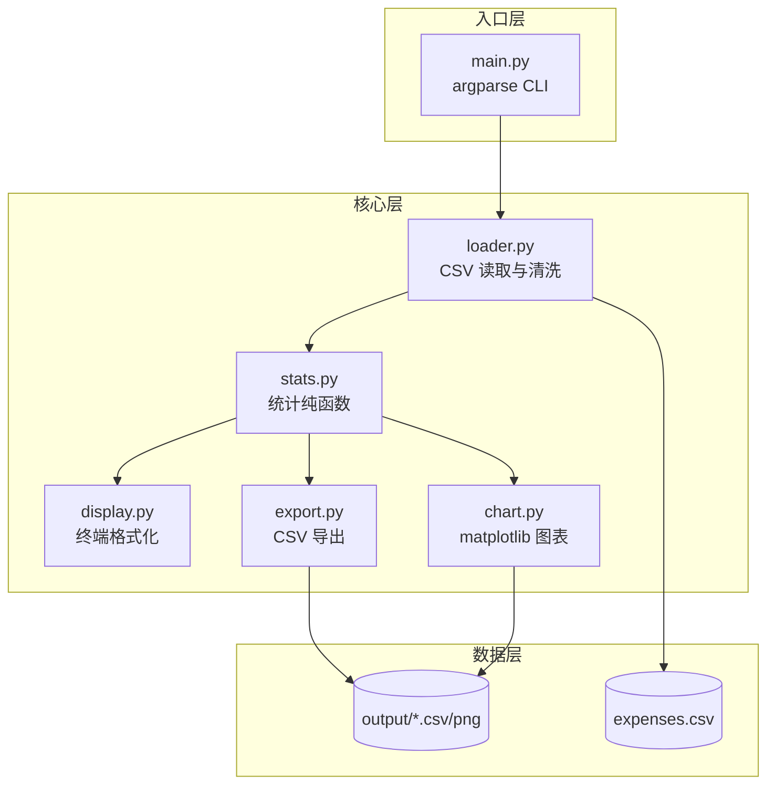
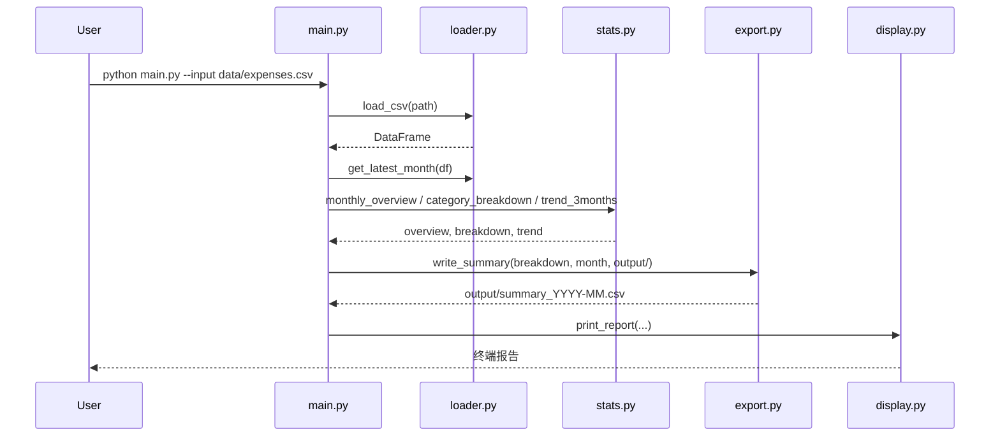

# 个人记账小助手（Personal-Income）快读报告

> **模式**：Standard  
> **路径**：`d:\project\Personal-Income`  
> **扫描时间**：2026-06-07  
> **仓库来源**：[https://github.com/renjing-2022/Personal-Income](https://github.com/renjing-2022/Personal-Income)（README 声明）

---

## 0. Executive Summary（30 秒读懂）

| 项 | 内容 |
|----|------|
| **一句话** | 读取收支 CSV，在终端展示当月收支全景与近 3 月趋势，支持汇总/明细导出，可选生成图表 |
| **类型** | CLI / Batch 数据处理小工具 |
| **成熟度** | 可演示（课程 MVP 完成度高，非生产级） |
| **运行状态** | **已验证可运行**（主流程 + 测试 + 图表均已实测通过） |
| **推荐行动** | **深入**（若目标是学习 CLI 工具拆分与 pandas 统计）；**仅参考**（若目标是生产级记账系统） |

这是一个 **Vibe Coding 课程作业型** 的 Python CLI 项目：代码量小（~400 行）、模块边界清晰、README 与设计文档齐全。最大价值在于「从需求到可 clone 仓库」的完整交付范例；最大风险是 **无 CI、无 LICENSE、测试覆盖窄**，以及 worktree 与根目录存在重复文件结构。

---

## 1. 项目目标与边界

### 1.1 解决什么问题

- 个人收支 CSV 需要人工汇总、看分类占比、看多月趋势，Excel 或手工计算成本高
- 提供一个 **零 UI、零数据库** 的命令行工具，一键生成终端报告 + 导出文件

### 1.2 目标用户

- 课程学员本人（需可演示、可写进 README 的 GitHub 小项目）
- 有 Python 基础、用 CSV 记账的个人用户

### 1.3 核心能力（功能列表）

1. 读取并清洗收支 CSV（跳过无效行并 `warnings.warn`）
2. 当月收支全景（收入、支出、结余）
3. 支出分类明细（金额 + 占比，降序）
4. 近 3 个月支出趋势表（含环比）
5. 导出分类汇总 CSV（默认）或原始明细 CSV
6. 可选生成饼图 + 折线图 PNG（`--chart`）

### 1.4 明确不做的事（Out of scope）

设计文档明确 YAGNI：

- 用户登录 / 数据库 / Web 界面
- 交互式录入账单
- 多 CSV 合并
- 预算预警、智能分类

### 1.5 许可证与约束

- **License**：仓库内 **未发现** LICENSE 文件 `[待澄清]`
- 商业/二次分发：无许可证时默认 **不建议** 对外商用或 fork 发布

---

## 2. 技术栈

| 层级 | 技术 | 证据（文件/版本） |
|------|------|-------------------|
| 语言 | Python 3.10+ | `README.md` |
| 框架 | argparse CLI | `main.py` |
| 数据处理 | pandas ≥ 2.0 | `requirements.txt`, `src/loader.py`, `src/stats.py` |
| 可视化 | matplotlib ≥ 3.7（Agg 后端） | `requirements.txt`, `src/chart.py` |
| 数据库/存储 | 无（CSV 文件 I/O） | `data/expenses.csv`, `output/` |
| 测试 | pytest | `tests/test_stats.py`，README 说明 |
| 基础设施 | 无 Docker/CI | Phase 0 扫描 `ci: []` |

**版本要求**：Python 3.10+，pandas 2.x，matplotlib 3.7+  
**外部服务依赖**：无

---

## 3. 目录与架构

### 3.1 顶层目录职责

```
Personal-Income/
├── main.py              # CLI 入口，流程编排
├── src/                 # 核心业务模块（loader/stats/display/export/chart）
├── data/                # 样本收支 CSV
├── tests/               # stats 单元测试
├── output/              # 运行时生成（.gitignore 忽略）
├── docs/superpowers/    # 设计规范 + 实现计划（课程文档）
├── .worktrees/          # git worktree 副本（.gitignore，本地开发用）
├── .cursor/skills/      # Cursor Agent 技能（非项目运行时依赖）
├── expenses.csv         # 根目录另有样本 CSV（与 data/ 可能重复）
└── README.md
```

### 3.2 架构风格

**CLI + Modular Monolith（模块化单体）**  
单一进程、按职责拆分为 5 个 `src/` 模块；`stats.py` 纯函数设计便于单测，符合「数据处理小工具」定位。

### 3.3 分层 / 模块关系



### 3.4 入口点清单

| 入口 | 路径 | 用途 |
|------|------|------|
| CLI 主入口 | `main.py` | `python main.py --input ...` |
| 测试入口 | `tests/test_stats.py` | `pytest tests/ -v` |
| 模块 API | `src/*.py` | 被 main 或测试 import |

---

## 4. 核心代码逻辑

### 4.1 主流程（Happy Path）

1. **解析参数**：`--input`（必填）、`--month`、`--export`、`--output`、`--chart`
2. **加载 CSV**：`load_csv()` 校验列、逐行清洗、构造 `年月`/`是收入`/`是支出` 列
3. **确定月份**：`args.month` 或 `get_latest_month(df)`（取日期最大值所在月）
4. **统计计算**：`monthly_overview` → `category_breakdown` → `trend_3months`
5. **导出**：默认 `write_summary`；`--export detail` 时 `write_detail`
6. **可选图表**：`generate_charts` 生成饼图 + 折线图
7. **终端输出**：`print_report` 打印三块报告 + 导出路径



### 4.2 关键模块

| 模块 | 路径 | 职责 | 关键符号 |
|------|------|------|----------|
| 入口编排 | `main.py` | argparse、流程串联、错误退出 | `main()`, `build_parser()` |
| 数据加载 | `src/loader.py` | CSV 读取、行级清洗、列校验 | `load_csv()`, `get_latest_month()` |
| 统计核心 | `src/stats.py` | 纯函数统计（可单测） | `monthly_overview()`, `category_breakdown()`, `trend_3months()` |
| 终端展示 | `src/display.py` | 中文对齐、货币格式化 | `print_report()`, `display_width()` |
| 导出 | `src/export.py` | UTF-8-BOM CSV 写出 | `write_summary()`, `write_detail()` |
| 图表 | `src/chart.py` | 延迟 import matplotlib，饼图合并 <5% 分类 | `generate_charts()` |

### 4.3 数据流

- **输入**：UTF-8 CSV，列 `日期,收支类型,分类,金额,备注`（`data/expenses.csv`，77 行样本）
- **处理**：无效行跳过 → 派生 `年月`/布尔列 → 按月聚合/分组/环比
- **输出**：
  - 终端：三块格式化报告
  - 文件：`output/summary_YYYY-MM.csv` 或 `detail_YYYY-MM.csv`
  - 图表：`output/pie_YYYY-MM.png`、`output/trend_3m.png`

### 4.4 配置与环境

- **配置来源**：命令行参数（无 `.env`、无配置文件）
- **必需环境变量**：无
- **配置陷阱**：
  - `--month` 格式必须为 `YYYY-MM`，否则 argparse 报错
  - 图表在 Windows 上可能出现 `¥` 字形缺失警告（SimHei 不含 YEN SIGN），不影响 PNG 生成
  - `pytest` 未写入 `requirements.txt`，需单独安装

---

## 5. 工程化现状

| 维度 | 状态 | 说明 |
|------|------|------|
| 文档 | ⭐⭐⭐⭐ /5 | README 完整；另有 design spec + 实现计划 |
| 测试 | ⭐⭐ /5 | 仅 4 个 stats 单测；loader/export/chart/display 无测 |
| CI/CD | ⭐ /5 | 无 `.github/workflows` |
| 类型安全 | ⭐⭐⭐ /5 | 使用 `from __future__ import annotations` 与类型注解，无 mypy |
| 安全基线 | ⭐⭐⭐⭐ /5 | 无硬编码密钥；本地 CSV 处理，攻击面小 |
| 可观测性 | ⭐ /5 | 无结构化日志；清洗用 `warnings.warn` |

**CI 摘要**：无  
**测试如何跑**：`pytest tests/ -v`（实测 4 passed，0.03s）

---

## 6. 运行与复现

### 6.1 官方步骤（README）

```bash
git clone https://github.com/renjing-2022/Personal-Income.git
cd Personal-Income
python -m venv .venv
# Windows: .venv\Scripts\activate
pip install -r requirements.txt
pip install pytest  # 可选

python main.py --input data/expenses.csv
pytest tests/ -v
```

### 6.2 实测步骤

```bash
cd d:\project\Personal-Income
pytest tests/ -v                                    # 4 passed
python main.py --input data/expenses.csv            # 分析 2026-05，导出 summary
python main.py --input data/expenses.csv --month 2026-01 --export detail --chart
```

### 6.3 运行结果

- **成功**：主流程、测试、图表导出均正常
- **轻微警告**：折线图保存时 `Glyph 165 (YEN SIGN) missing from font(s) SimHei`
- **缺失项**：无 LICENSE、无 CI、pytest 非正式依赖

---

## 7. 优势与劣势（SWOT 精简）

### 7.1 优势 ✅

1. **模块边界清晰**：loader / stats / display / export / chart 各司其职，README 表格与代码一致
2. **stats 纯函数 + 单测**：核心逻辑可测、可复用，`trend_3months` 环比边界（上月为 0 显示 `—`）有覆盖
3. **中文终端友好**：`display.py` 用 `unicodedata.east_asian_width` 做列对齐
4. **文档齐全**：设计 spec 定义 MVP/加分项/YAGNI，与实现高度对齐
5. **增量 Git 历史**：10 次 commit 按功能递进（stats → loader → display → export → chart → main → README）

### 7.2 劣势与风险 ⚠️

| 级别 | 项 | 说明 |
|------|-----|------|
| 🟡 | 无 LICENSE | 开源协作与商用边界不清 |
| 🟡 | 无 CI | 回归依赖手动跑 pytest |
| 🟡 | 测试覆盖窄 | 仅 stats；loader 清洗、export 编码、chart 无测 |
| 🟡 | pytest 未入 requirements | clone 后易漏装测试依赖 |
| 🟢 | 根目录 `expenses.csv` 冗余 | 与 `data/expenses.csv` 并存，易混淆 |
| 🟢 | 图表字体警告 | Windows 下 ¥ 符号可能显示为方块 |
| 🟢 | loader 逐行 iterrows | 样本数据无性能问题；大数据量会慢 |

### 7.3 与同类/预期差距

- 对比 **生产级记账 App**：无持久化、无 Web/GUI、无多账户/预算
- 对比 **课程 MVP 预期**：功能清单 **已全部实现**（含 `--chart` 加分项）

---

## 8. 缺口清单（仓库缺什么）

- [ ] LICENSE 文件（MIT/Apache-2.0 等）
- [ ] GitHub Actions（至少 `pytest` on push）
- [ ] `requirements-dev.txt` 或把 pytest 写入主依赖
- [ ] loader / export 的基础测试
- [ ] `.env.example`（当前不需要，可 N/A）
- [ ] 统一 CSV 样本路径（建议只保留 `data/expenses.csv`）

---

## 9. 上手路径

### 15 分钟

1. 读 `README.md` + `main.py`（80 行，全流程一目了然）
2. 运行 `python main.py --input data/expenses.csv`
3. 打开 `src/stats.py` 理解三个统计函数

### 1 小时

1. 跑通 `pytest tests/ -v`，读 `tests/conftest.py` 理解测试数据结构
2. 给 `loader.py` 补 1～2 个清洗场景测试（无效日期、空分类→「未分类」）
3. 尝试 `--chart` 并查看 `output/` 产物

### 1 天

1. 加 GitHub Actions CI
2. 补 LICENSE + 把 pytest 纳入 dev 依赖
3. 扩展功能（如 `--month` 范围报告、多 CSV 合并）并更新 design spec

---

## 10. 待澄清问题（给维护者/自己）

1. 根目录 `expenses.csv` 与 `data/expenses.csv` 是否应合并为一个 canonical 路径？
2. `feature/personal-income-tracker` worktree 与 `main` 的关系——是否已合并、worktree 是否仍需保留？
3. 是否计划添加 LICENSE 并推送到 GitHub remote？

---

## 11. 附录

### A. Phase 0 扫描摘要

| 字段 | 值 |
|------|-----|
| 文件数 | 103 |
| 总体积 | 0.62 MB |
| 生态 | Python |
| 清单 | `requirements.txt` |
| CI | 无 |
| 测试目录 | `tests/` |
| 入口 | `main.py` |
| README | 有 |
| LICENSE | 无 |
| .env.example | 无 |

> 注：`scan_project.py` 位于 `.cursor/skills/github-project-recon/scripts/`，非项目根 `scripts/`。

### B. 关键文件阅读清单

| 优先级 | 文件 | 原因 |
|--------|------|------|
| P0 | `main.py` | 全流程入口 |
| P0 | `src/stats.py` | 核心业务逻辑 |
| P0 | `src/loader.py` | 数据契约与清洗规则 |
| P1 | `README.md` | 安装运行说明 |
| P1 | `docs/superpowers/specs/2026-06-07-personal-income-tracker-design.md` | 需求边界与 CLI 契约 |
| P1 | `tests/test_stats.py` | 统计行为预期 |

### C. Git 最近提交（节选）

```
1c6df5b fix: code review fixes and update sample data
1ca3c2a docs: add README with install and usage guide
b7f236e feat: wire up CLI main flow end-to-end
1776534 feat: add pie and line chart generation
...
3082aae feat: add monthly_overview stats with tests
```

分支：`main`（当前）、`feature/personal-income-tracker`（worktree 存在）

---

**结论**：这是一个 **结构良好、文档完备、已可演示** 的 Python CLI 记账分析工具，非常适合作为课程交付物或 CLI/pandas 学习样例。若用于长期维护或对外开源，建议优先补齐 **LICENSE + CI + 测试覆盖**。
